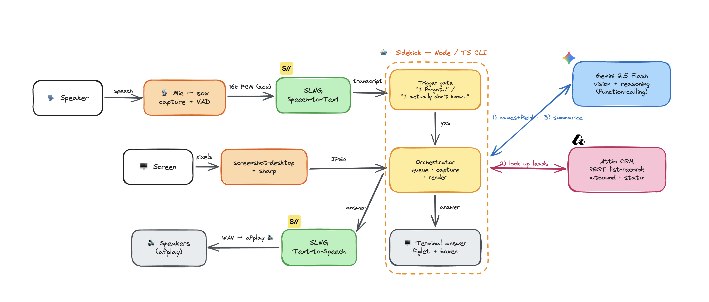

# Hackathon: Sidekick

An ambient **voice + screen copilot** for sales meetings. It listens to the conversation,
watches your screen, and when someone says a trigger word it "kicks in" — reads the lead names
off the screen, looks them up in **Attio**, and answers out loud and in the terminal.

```
🗣  I forgot if these have LinkedIn outbounds right now?
⠋  Sidekick is thinking…
✔  Completed thinking

      ____  ______
     |___ \|___ /
       __) | |_ \      2 / 3
      / __/ ___) |
     |_____|____/

╭───────────────── Sidekick ─────────────────╮
│  2 of 3 have LinkedIn outbounds (Acme and   │
│  Globex); Initech doesn't.                   │
│                                              │
│  ✓  Acme Corp — LinkedIn outbound            │
│  ✓  Globex — LinkedIn outbound               │
│  ✗  Initech — no LinkedIn outbound           │
╰──────────────────────────────────────────────╯
```

---

## How it works

```
mic → SLNG STT → transcript ─┐
                             ├─ stage 1: trigger word ("forgot" / "don't know")?
screen → screenshot ─────────┘        ↓ yes
                       stage 2: Gemini reads the names + picks the field (function-calling)
                                → Attio REST (list records on companies)
                                → one-sentence answer → terminal (figlet/boxen) + SLNG TTS
```

- **Gemini** (`@google/genai`, `gemini-2.5-flash`) — vision reads names off the screen + reasoning + function-calling.
- **SLNG** ([slng.ai](https://slng.ai)) — real-time STT (Deepgram Nova-3) and TTS (Deepgram Aura-2).
- **Attio** — CRM lookups via REST (`list records` on the `companies` object).

## Architecture Diagram


---

## Prerequisites

| Tool | Version | Notes |
|---|---|---|
| **Node** | ≥ 20 (built on 24) | `node -v` |
| **pnpm** | ≥ 9 | `corepack enable pnpm` or `npm i -g pnpm` |
| **sox** | any | `brew install sox` — required for microphone capture |
| **macOS** | — | for `afplay` (TTS playback) and CoreAudio mic capture |

API keys (all free tiers):
- **Google AI** — [aistudio.google.com/apikey](https://aistudio.google.com/apikey) *(required)*
- **Attio** — Attio ▸ Settings ▸ Developers ▸ API Keys *(required; a read-only key is enough)*
- **SLNG** — [app.slng.ai](https://app.slng.ai) · docs: [docs.slng.ai/hackathon](https://docs.slng.ai/hackathon) *(optional — without it, runs in text mode with no voice)*

---

## Quick start

```bash
# 1. clone
git clone git@github.com:xliiauo/hackathon.git
cd hackathon/sidekick

# 2. system + node deps
brew install sox
corepack enable pnpm          # or: npm i -g pnpm
pnpm install

# 3. configure
cp .env.example .env          # then edit .env and paste your keys (see below)

# 4. (macOS) grant Terminal permission for Microphone + Screen Recording
#    System Settings ▸ Privacy & Security ▸ Microphone / Screen Recording

# 5. sanity-check every integration end-to-end
pnpm verify

# 6. run it
pnpm dev                      # mic + voice + Gemini + Attio (the live demo)
```

---

## Configure `.env`

```bash
# --- Gemini (required) ---
GOOGLE_API_KEY=your_google_ai_key
# GEMINI_MODEL=gemini-2.5-flash

# --- SLNG voice (optional; omit → text mode, no speech) ---
SLNG_API_KEY=your_slng_key
SLNG_STT_MODEL=slng/deepgram/nova:3-multi
SLNG_TTS_MODEL=slng/deepgram/aura:2-en
SLNG_TTS_VOICE=aura-2-theia-en
SLNG_TTS_SPEED=2                       # playback speed (pitch-preserving); 1 = normal

# --- Attio (required for lookups) ---
ATTIO_API_KEY=your_attio_key
# ATTIO_OBJECT=companies
# ATTIO_ATTR_OUTBOUND=outbound         # a 'select'; option titled "LinkedIn" = has outbound
# ATTIO_ATTR_STATUS=status             # a 'status'; e.g. "Interested"

# --- Capture / mic (optional) ---
# MIC_DEVICE="Wireless Mic Rx"         # exact CoreAudio name; empty = system default
# MIC_THRESHOLD=600                    # VAD loudness cutoff; lower for quiet mics
# CAPTURE_DISPLAY=                     # display id to screenshot (multi-monitor)
# SIDEKICK_TRIGGERS=forgot|don't know  # override trigger words (pipe-separated)
```

### Full environment reference

| Var | Default | Purpose |
|---|---|---|
| `GOOGLE_API_KEY` | — | **Required.** Gemini vision + reasoning. |
| `GEMINI_MODEL` | `gemini-2.5-flash` | Model id. |
| `SLNG_API_KEY` | — | Voice (STT + TTS). Omit → text mode. |
| `SLNG_STT_MODEL` | `slng/deepgram/nova:3-multi` | Speech-to-text model. |
| `SLNG_TTS_MODEL` | `slng/deepgram/aura:2-en` | Text-to-speech model. |
| `SLNG_TTS_VOICE` | `aura-2-theia-en` | TTS voice. |
| `SLNG_TTS_SPEED` | `2` | Playback speed multiplier (sox tempo). |
| `ATTIO_API_KEY` | — | **Required for lookups.** |
| `ATTIO_API_BASE` | `https://api.attio.com/v2` | REST base URL. |
| `ATTIO_OBJECT` | `companies` | Object the leads live on. |
| `ATTIO_ATTR_OUTBOUND` | `outbound` | Select attr; option `"LinkedIn"` ⇒ ✓. |
| `ATTIO_ATTR_STATUS` | `status` | Status/interest attr. |
| `MIC_DEVICE` | (default mic) | CoreAudio input device name. |
| `MIC_THRESHOLD` | `600` | VAD speech/silence cutoff. |
| `CAPTURE_DISPLAY` | (primary) | Display id to screenshot. |
| `SIDEKICK_TRIGGERS` | `forgot\|don't know\|dont know` | Trigger words (contains-match). |

---

## Attio setup

Lookups hit `POST /v2/objects/{ATTIO_OBJECT}/records/query` (list records) and read two attributes
on the `companies` object — adjust the slugs to your workspace:

- **`outbound`** — a *select* attribute. The option titled **`LinkedIn`** means "has a LinkedIn outbound" (✓).
- **`status`** — a *status* attribute (e.g. `Interested`, `Connecting`, `Not interested`).

For the demo, seed a few companies with those values set. Run `pnpm verify` to do a real lookup
against your workspace and print what it found.

> The official hosted Attio MCP (`mcp.attio.com/mcp`) requires OAuth, which a read-only API key can't
> satisfy — so Sidekick uses Attio's REST API directly with your key.

---

## Running

```bash
pnpm dev       # mic + voice + Gemini + live Attio  (the live demo)
pnpm text      # type questions instead of speaking (names taken from what you type)
pnpm verify    # end-to-end check: SLNG round-trip, Attio lookup, Gemini vision, screen capture
pnpm typecheck # tsc --noEmit
```

### Triggering

Sidekick fires only when an utterance **contains** a trigger word — by default **`forgot`** or
**`don't know`**:

```bash
pnpm dev
# say: "I forgot if these have LinkedIn outbounds?"
# say: "I actually don't know which one is interested."
```

In `pnpm text` mode the names come from what you type, so you can test without a screen:

```bash
pnpm text
› I forgot if Acme Corp and Globex have LinkedIn outbounds?
```

---

## Troubleshooting

| Symptom | Fix |
|---|---|
| `spawn sox ENOENT` | `brew install sox`. |
| `sox FAIL ... no default audio device configured` | Sidekick sets `AUDIODRIVER=coreaudio` automatically; if you still see it, confirm `sox --help` lists `coreaudio` under AUDIO DEVICE DRIVERS. |
| `mic error` / no transcript | Grant **Microphone** permission to your terminal (System Settings ▸ Privacy & Security ▸ Microphone), then restart it. |
| Screen capture blank / errors | Grant **Screen Recording** permission to your terminal. |
| Wrong mic used | Set `MIC_DEVICE` to the exact device name. List names with: `system_profiler SPAudioDataType`. |
| Trigger never fires | The word must be present ("forgot" / "don't know"); add phrasings via `SIDEKICK_TRIGGERS`. Lower `MIC_THRESHOLD` if a quiet wireless mic isn't segmenting speech. |
| Lookup says "not found" | The on-screen / typed name must match the Attio company name (matched via `name $contains`). Check `ATTIO_OBJECT` and attribute slugs. |
| No voice, only terminal | `SLNG_API_KEY` not set → text mode. Add the key for speech. |

---

## Project structure

```
sidekick/
├─ src/
│  ├─ index.ts            # orchestrator: queue · trigger · capture · render
│  ├─ config.ts           # env + system instruction
│  ├─ core/               # trigger (stage 1), agent (stage 2, Gemini), transcript
│  ├─ voice/              # mic (sox+VAD), stt + tts (SLNG), wav
│  ├─ capture/screen.ts   # screenshot-desktop + sharp
│  ├─ integrations/attio.ts # Attio REST list-records
│  ├─ tools/lookupLeads.ts  # the lookup_leads function declaration
│  └─ ui/output.ts        # figlet/boxen cards + ora spinner
├─ scripts/verify.ts      # end-to-end integration check
├─ docs/architecture.excalidraw
└─ .env.example
```

## Stack

Node · TypeScript · pnpm · `@google/genai` · SLNG · Attio REST · `sox` / `node-record-lpcm16` ·
`screenshot-desktop` · `sharp` · `ora` · `figlet` · `boxen` · `chalk`.

## Authors
* Xiao Liu
* Owen Kosman
